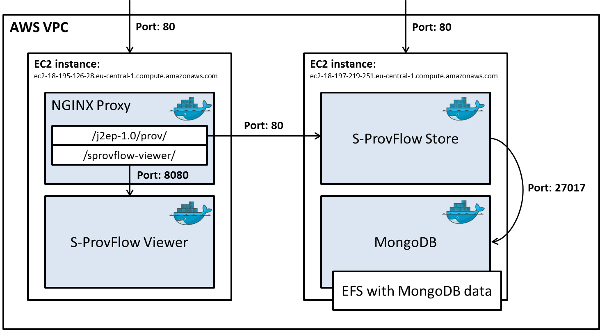

# Running the playbook

## Git Submodules
To be able to run the playbook, you will also need to pull the submodules, which contain generic ansible roles.
This can be done via the following command
```
git submodule update --init --recursive
```

## Options to run
First make sure that you have ssh access to the hosts.
If this precondition is met, you have several options for running the ansible playbooks:

1. **Run without restoring the test database:** 
```
ansible-playbook -i aws site.yml
```

2. **Run with restoring the test database (Note that this drops the current database):**
```
ansible-playbook -i aws site.yml --extra-vars '{"RESTORE_DATABASE_DUMP":true}' 
```
The testdatabase is a dump which contains data for the user 'aspinuso'. The dump can be found here: 
https://s3.eu-central-1.amazonaws.com/eu-team-example-files/DARE/S-Provenance/test-provdb.gz
Small AWS instances might run out of memory when restoring the database. 
If this is the case, it temporarily needs to be upgraded to an instance with more memory available.

3. **Running specific tasks by using tags:**
```
ansible-playbook -t viewer -i aws site.yml
```
This allows you to only deploy parts of the system. The tags can be found inside the playbooks.

# Verifying if the deployment works
## Frontend
Navigate to http://ec2-18-195-126-28.eu-central-1.compute.amazonaws.com/sprovflow-viewer/html/view.jsp.
As a username choose 'aspinuso', because this user has data.
Then you can select a RunId and visualize the provenance.

## Backend
The backend can be accessed via http://ec2-18-197-219-251.eu-central-1.compute.amazonaws.com/swagger/

# Docker registry
Currently the images are hosted on docker hub: https://hub.docker.com/search/?isAutomated=0&isOfficial=0&page=1&pullCount=0&q=rdwdknmi&starCount=0

## Pushing a new version of the image
TODO: Add doc for the viewer
First, ask rights to push to the registry. Also make sure that your image is named correctly.
This can be done via the following command:
```
docker image tag <name_of_original_image>:<tag> rdwdknmi/s-provenance-store:<commit-hash>
docker image tag <name_of_original_image>:<tag> rdwdknmi/s-provenance-viewer:<commit-hash>
```
We use the commit hash as a tag such that it is always possible to trace-back which version of the code the docker image is based on.

Use the following command to push the images:
```
docker login (enter your docker hub userid and password)
docker push rdwdknmi/s-provenance-store:<tag>
docker push rdwdknmi/s-provenance-viewer:<tag>
```

# Deployment considerations

## Overview of the current AWS environment
The figure below gives an overview of the current AWS environment which can be deployed via ansible.



In the following paragraphs a few considerations concerning this deployment will be discussed.

## Running MongoDB in a docker container
Currently we run MongoDB in a docker container. 
For more future-proof deployments it is most likely better to use a hosted instance of MongoDB, 
such that we do not need to worry about scaling and backups.

## Using NFS for MongoDB
In this first version of the deployment we use an NFS mount to store the MongoDB data. 
This because it will scale automatically on AWS and therefore there is no need to monitor the diskspace and increase it when limits are reached.
This will however have a performance implication, as mentioned in the MongoDB documentation:

_With the WiredTiger storage engine, 
WiredTiger objects may be stored on remote file systems if the remote file system conforms to ISO/IEC 9945-1:1996 (POSIX.1). 
Because remote file systems are often slower than local file systems, 
using a remote file system for storage may degrade performance._

Source: https://docs.mongodb.com/manual/administration/production-notes/#kernel-and-file-systems

Note that the specified MongoDb image indeed uses the WiredTiger storage engine.

## Communication between instances
Communication between the instances are done within the VPC, to prevent
unnecessary traffic outside of AWS.
This has been achieved by using internal ip-addresses to refer to the different services. 

## Need for a proxy
Currently a proxy runs inside the viewer container, J2EP, which proxies the 
backend requests initiated by the frontend to the backend. This proxy is configured via
resources/data.xml to point to 172.17.0.1:8082, this configuration is prepackaged in
j2ep-1.0.war. This .war is copied directly into the docker image. 

In our case we need to proxy to a different host, since the backend runs
on a separate EC2-instance. Consequently, we need to update the configuration.
Simply replacing the data.xml in the deployed war in the docker container
does not seem to have any effect. It is currently also undocumented how j2ep-1.0.war is built,
therefore it was also not possible to provide a new .war file or build it in the docker.
As a temporary solution we have added a new NGINX proxy running in a docker container,
which proxies the request. 

The configuration of this proxy can be found in 
ansible/roles/viewer/files/nginx.conf. The variables are replaced by the ansible scripts
to match the values defined in the host file (ansible/aws)

## AWS instance size
Sometimes memory issues occur when restoring the backup in the MongoDB docker container. 
The instance size of the backend EC2-instance has already been increased to t2.small, 
but in some cases issues still occur. If you want to restore a MongoDB backup and
run into memory issues, it is advised to increase the AWS instance size. 

## Provisioning the AWS configuration
Currently the AWS configuration has been manually created. In the future
it would be good to be able to provision necessary configuration via
automatic scripts.


